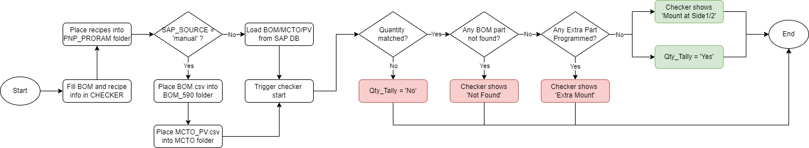
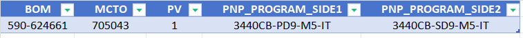
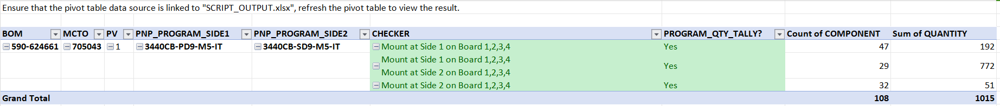

# PNP_PROGRAM_CHECKER
To validate created PNP Programs against SAP BOM

 

 

### Installation
- Fork this project [here](https://github.com/jiajunlee19/pnp-program-checker-app/fork)
  
    OR
   
- Clone this project by `git clone "https://github.com/jiajunlee19/pnp-program-checker-app.git"`
  
    OR
   
- Download this project in zip [here](https://github.com/jiajunlee19/pnp-program-checker-app/archive/refs/heads/master.zip) and extract

 

### How to run?
0. (Optional) Go to `settings` sheet in [CHECKER.xlsx](CHECKER.xlsx), modify the settings if needed.
1. Go to `CHECKER` sheet in [CHECKER.xlsx](CHECKER.xlsx), fill in the BOM and program info.
    - 
2. (Only for SAP_SOURCE = `manual`) Place all required files into the designated subfolders [BOM_590](BOM_590/), [MCTO](MCTO/) and [PNP_PROGRAM](PNP_PROGRAM/) accordingly.
3. Run [main.exe](main.exe).
4. Go to `RESULT` sheet in [CHECKER.xlsx](CHECKER.xlsx), refresh the pivot table to view the result.
    - Ensure that the pivot table data source is linked to [SCRIPT_OUTPUT.xlsx](SCRIPT_OUTPUT.xlsx)
    - Color code of `GREEN` indicates passed and `RED` indicates failed.
    - 
    - Detailed information can be viewed by double-clicking the value in pivot table.
5. (Optional) View logs in [Log/PNP_PROGRAM_CHECKER.log](Log/PNP_PROGRAM_CHECKER.log).
6. (Optional) View detailed program info in [SCRIPT_OUTPUT_PROGRAM.xlsx](SCRIPT_OUTPUT_PROGRAM.xlsx)

 

### Test Cases
Below are the passing test cases, using [590-624661](BOM_590/590-624661.csv) with its [PNP_PROGRAM](PNP_PROGRAM/590-624661/).
| Scenario                                                       | Result                                                  |
| :---                                                           | :---                                                    |
| Part Number, Designator, Quantity are matched                  | Checker and PROGRAM_QTY_TALLY shows `green`             |
| BOM Part is missing in Program                                 | Checker shows `red` and PROGRAM_QTY_TALLY shows `red`   |
| Part is extra programmed                                       | Checker shows `red` and PROGRAM_QTY_TALLY shows `red`   |

 